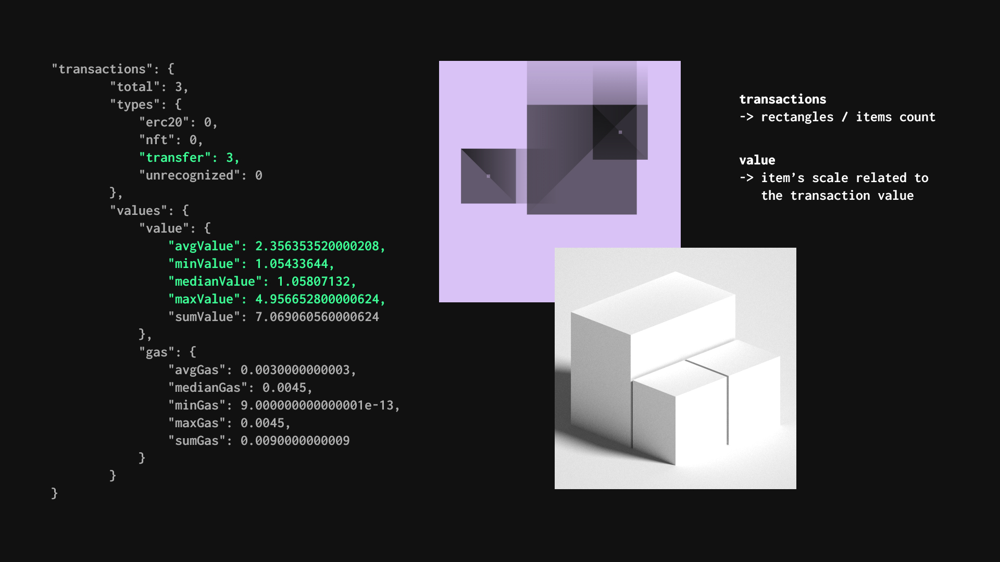

### Transforms Ethereum block's metadata
### to a humanized view.

### &nbsp;

**Transaction Types**
* `erc20`, `nft`, `transfer`, `unrecognized`

**Transaction Value, Gas**
* `average`, `minimum`, `maximum`, `median`, `summ` `value`/`gas` in transactions array

**Block Season**
* `winter`, `sprint`, `summer`, `autumn`

**Daytime**
* `night`, `morning`, `day`, `afterday`, `evening` in UTC

### &nbsp;

### This package uses block data structure via EthBlock.Art.

If you want to use this package outside of EthBlock.Art development boilerplate, you need to be sure if the block data structure from your API are prepared to this package structure based on [useDApp](https://github.com/EthWorks/useDApp)'s (and EthBlock.Art) block metadata response.

Different APIs are gives different 'block metadata'.

For example, `web3` node module has `input` instead of `data` property in transactions array item.

### &nbsp;

## Install & Use

```
npm i ethblockart-humanizer
```

```js
import { getBlockHumanized } from 'ethblockart-humanizer';

// ...
const humanizedBlock = getBlockHumanized(block);
// ...
```

Result:

```js
{
    "number": 13596479,
    "season": "autumn",
    "daytime": "evening",
    "time": "2021-11-11T18:20:00.000Z",
    "transactions": {
        "total": 294,
        "types": {
            "erc20": 93,
            "nft": 0,
            "transfer": 144,
            "unrecognized": 57
        },
        "values": {
            "value": {
                "avgValue": 0.3343366122304634,
                "minValue": 0,
                "medianValue": 0,
                "maxValue": 21.995,
                "sumValue": 98.29496399575623
            },
            "gas": {
                "avgGas": 0.035442864392160454,
                "medianGas": 0.017042417914345,
                "minGas": 0.0031647,
                "maxGas": 1.2892222294735,
                "sumGas": 10.420202131295174
            },
            "data": [
                {
                    "hash": "0xb41984c70cd05687fbc5d721c6bb2c02ee8158201c1749f8bb9645ea5899d7d7",
                    "type": "unrecognized",
                    "value": 0,
                    "gas": 0.07462853334800001
                },
                // ...
            ]
        }
    }
}
```

### &nbsp;

# Created for EthBlockArt Humanizer

### https://zashi.art/ebah

[EthBlockArt](https://ethblock.art) is about facing a mirror towards the chain we use and data we create.

**EthBlockArt Humanizer** extends that, surfacing the connection between data and visual.

&nbsp;


&nbsp;

# Functions

* `getBlockHumanized(block)`, — get humanized metadata. `block` is Ethereum block metadata object. You can use only this function.

&nbsp;

* `getTransactionsHumanized(transaction)`, — get only `{ values, types }` result. `transaction` is Ethereum block transaction **object**. 

* `getTransactionHumanizedTypeName(transaction)` — get only calculated transaction's type.

* `getBlockHumanizedSeason(block)` — get calculated season name.

* `getBlockHumanizedDaytime(block)` — just get timestamp property in UTC format.

&nbsp;
&nbsp;

2021, MIT License, Zashi Frovano